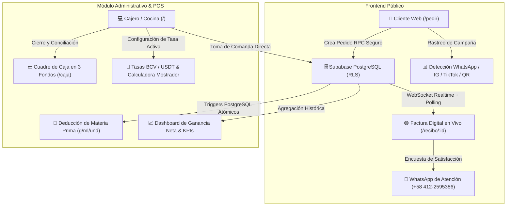

# 🫓 La Parada del Sabor — Sistema POS, Pedidos Web & Control Gastronómico Realtime

[](https://nextjs.org/)
[](https://react.dev/)
[](https://www.typescriptlang.org/)
[](https://supabase.com/)
[](https://tailwindcss.com/)
[](https://la-parada-del-sabor.vercel.app)
[](https://la-parada-del-sabor.vercel.app)

> 🚀 **Demo en Vivo (Producción):** [https://la-parada-del-sabor.vercel.app](https://la-parada-del-sabor.vercel.app)  
> 🛍️ **Catálogo Web de Clientes:** [https://la-parada-del-sabor.vercel.app/pedir](https://la-parada-del-sabor.vercel.app/pedir)

---

## 📌 Descripción del Proyecto

**La Parada del Sabor** es una plataforma web fullstack integral diseñada para optimizar y digitalizar la operación completa de restaurantes y locales de comida rápida especializados en arepas gourmet y platos personalizados.

A diferencia de los puntos de venta genéricos (que controlan inventario 1 a 1), este sistema cuenta con un **motor de escandallo gastronómico (Bill of Materials)** que deduce automáticamente la materia prima en **gramos ($g$), mililitros ($ml$) y unidades ($und$)** cada vez que se prepara una comanda, integrando además **pedidos web públicos con sincronización en tiempo real vía WebSocket**, **cuadre de caja multi-fondo** y **blindaje de seguridad de nivel de producción**.

---

## 🧱 Arquitectura del Sistema



---

## ✨ Funcionalidades Principales

### 🍽️ Operativas y de Negocio (Para Dueños y Personal)
1. **Punto de Venta Táctil (POS):**
   - Modal flotante gourmet para búsqueda reactiva y alta rápida de clientes sin salir de la orden.
   - Modificadores y extras dinámicos (+Queso Guayanés, +Tocineta, salsas).
   - Generación instantánea de comandas para cocina y comprobante digital imprimible en PDF.
2. **Motor de Escandallo e Inventario Gastronómico:**
   - Control de inventario en gramos, mililitros y unidades.
   - Descuento atómico de stock mediante Triggers en base de datos al enviar o confirmar comandas.
   - Compras con factor de conversión automático (ej. 1 saco de harina de 20 kg = 20,000 gramos en stock).
3. **Cuadre y Arqueo de Caja Estructurado en 3 Fondos Segregados:**
   - 💵 **Efectivo Físico en Gaveta:** Dólares ($) y Bolívares (Bs) físicos con cálculo de arqueo (Fondo Inicial + Ventas - Gastos).
   - 📱 **Bolívares Digitales (BFC):** Pago Móvil BFC y Transferencias Bancarias (conciliación bancaria).
   - 🌐 **Dólares Digitales & Cripto:** Binance Pay (USDT) y Zelle (USD) (conciliación en billeteras).
4. **Calculadora de Mostrador y Gestión de Tasas (`/tasas`):**
   - Sincronización de tasas oficiales (BCV, Binance USDT, Euro y Promedio Ponderado).
   - Calculadora física de conversión con soporte completo de **teclado numérico físico (Numpad)**.
5. **Dashboard Financiero Continuo (`/dashboard`):**
   - Comparativas semana a semana y mes a mes con desglose de facturación, costo de insumos y ganancia neta.

---

### 📱 Experiencia del Cliente Final
1. **Catálogo Web de Autoservicio (`/pedir`):**
   - Navegación visual optimizada para móviles.
   - Detección automática del origen del cliente (WhatsApp, Instagram, TikTok, código QR de mesa).
2. **Factura Digital con Seguimiento en Vivo (`/recibo/[id]`):**
   - **Actualización 100% en tiempo real sin recargar página** (`Por Confirmar` ➔ `En Cocina` ➔ `¡Listo para Despacho!` ➔ `Entregado`).
   - Notificación sonora mediante **Web Audio API** sintetizado y vibración háptica (`navigator.vibrate`) en teléfonos móviles.
   - Encuesta interactiva de 3 preguntas de satisfacción con envío automático estructurado a WhatsApp.

---

## 🛠️ Aspectos Técnicos y Decisiones de Ingeniería (Tech Highlights)

| Área | Implementación Técnica | Beneficio |
|---|---|---|
| **Framework Fullstack** | Next.js 16.3 con App Router, Turbopack y React 19 Server Components. | Carga inicial ultrarrápida, streaming y SEO optimizado. |
| **Sincronización Híbrida Realtime** | Supabase Realtime (`postgres_changes` vía WebSocket) + Polling inteligente de respaldo cada 3.5s (con auto-desconexión en estados terminales o pestaña inactiva). | Cero desfase en la interfaz del cliente con resiliencia total ante conexiones móviles inestables. |
| **Seguridad de Base de Datos** | **Row Level Security (RLS)** en el 100% de las tablas (15 tablas). `REVOKE` total de escritura a usuarios anónimos. | Base de datos blindada contra inyecciones y accesos no autorizados. |
| **Protección Anti-Fuerza Bruta** | Rate limiting persistente a nivel de base de datos (`login_attempts` + RPC `fn_check_login_rate_limit`). | Protección que sobrevive a los reinicios de instancias serverless (cold-starts de Vercel/Edge). |
| **Seguridad de Servidor** | Middleware de sesión Next.js + Server Actions con verificación `requireAuth()` y saneamiento estricto de tipos (`NaN`, `Infinity`, números negativos, límites de unidades 1..25 en web / 1..50 en POS). | Imposibilidad de manipulación de totales o precios desde el cliente. |
| **Web Audio Synthesis** | Motor Web Audio API nativo en TypeScript sin dependencias externas ni archivos MP3 pesados. | Cero latencia y carga instantánea de efectos sonoros armónicos (pops, chimes y campanas). |
| **Cabeceras HTTP de Seguridad** | HSTS (`max-age=63072000`), `X-Frame-Options: DENY`, `X-Content-Type-Options: nosniff`, `Referrer-Policy`, `Permissions-Policy`. | Grado A+ en pruebas de seguridad web. |

---

## 🗄️ Esquema de Base de Datos Relacional

El sistema está soportado por un esquema relacional normalizado en PostgreSQL:

* `categorias`: Agrupación de productos gastronómicos.
* `insumos`: Materia prima con costo unitario promedio y stock en `g`, `ml` o `und`.
* `productos`: Platos terminados, arepas y especialidades.
* `recetas_ingredientes`: Tabla puente de escandallo (relación producto $\leftrightarrow$ insumo con gramajes).
* `extras_modificadores`: Agregados y modificadores (+Queso, salsas, etc.) vinculados a insumos de stock.
* `clientes`: Directorio de clientes, direcciones de delivery y fidelización.
* `proveedores` & `proveedor_insumos`: Proveedores y compras con factor de conversión.
* `compras` & `compras_items`: Registro de compras con recálculo automático de stock y costo promedio.
* `ventas`, `ventas_items`, `ventas_items_extras`: Comandas y ventas vinculadas a clientes, tasas y métodos de pago.
* `sesiones_caja`: Arqueo y conciliación de turnos de caja en efectivo y cuentas bancarias.
* `tasas_cambio`: Histórico y configuración de tasa activa de facturación.
* `login_attempts`: Registro persistente de intentos de autenticación y rate limiting.

---

## 🚀 Instalación y Puesta en Marcha Local

### Prerrequisitos
* **Node.js:** v18.17.0 o superior (recomendado Node.js 20+).
* **npm**, **pnpm** o **yarn**.
* Cuenta activa en **Supabase** (o instancia local de PostgreSQL).

### 1. Clonar el Repositorio
```bash
git clone https://github.com/YecksonG/la-parada-del-sabor.git
cd la-parada-del-sabor
```

### 2. Instalar Dependencias
```bash
npm install
```

### 3. Configurar Variables de Entorno
Copia el archivo de ejemplo y configura tus claves de Supabase:
```bash
cp .env.example .env.local
```

Edita `.env.local` con tus credenciales:
```env
NEXT_PUBLIC_SUPABASE_URL=https://tu-proyecto.supabase.co
NEXT_PUBLIC_SUPABASE_ANON_KEY=tu-anon-key-publica-aqui
NEXT_PUBLIC_SITE_URL=http://localhost:3000
NEXT_PUBLIC_WHATSAPP_PHONE=584122595386
```

### 4. Inicializar la Base de Datos en Supabase
Ejecuta en el **SQL Editor de Supabase** los scripts ubicados en la carpeta `supabase/`:
1. `supabase/schema.sql` (Esquema maestro, triggers y funciones).
2. `supabase/AUDITORIA_SEGURIDAD_MASTER_RLS.sql` (Habilitación de RLS y Anti-Brute Force).
3. `supabase/seed_initial_data.sql` *(Opcional: Datos iniciales de prueba)*.

### 5. Iniciar el Servidor de Desarrollo
```bash
npm run dev
```
Abre [http://localhost:3000](http://localhost:3000) en tu navegador.

### 6. Compilación de Producción
```bash
npm run build
npm run start
```

---

## 👨‍💻 Autor & Contacto

* **Desarrollador:** Yeckson González ([@YecksonG](https://github.com/YecksonG))
* **Rol:** Fullstack Software Engineer & Systems Architect
* **Especialidad:** Next.js, React, TypeScript, Supabase, Cloud Architecture, Realtime Web & UI/UX Systems.
* **GitHub:** [https://github.com/YecksonG](https://github.com/YecksonG)

---

## 📄 Licencia

Este proyecto se encuentra bajo la licencia **MIT**. Consulta el archivo `LICENSE` para más detalles.
